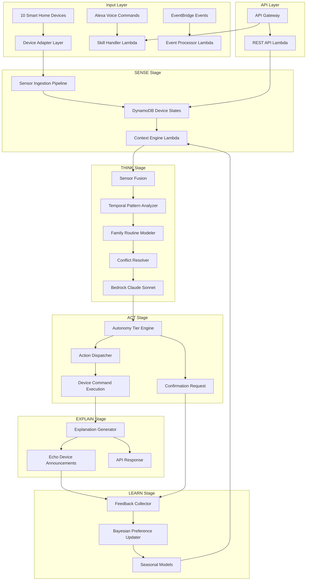
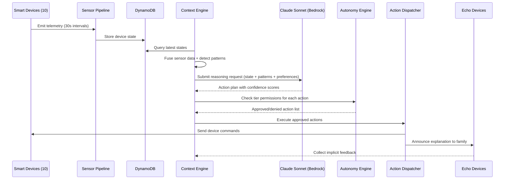
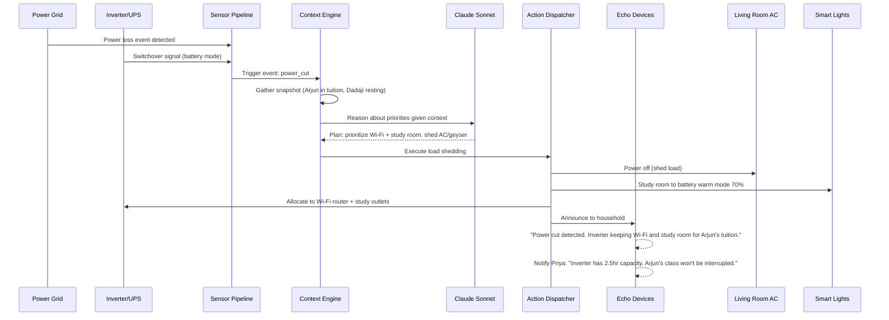
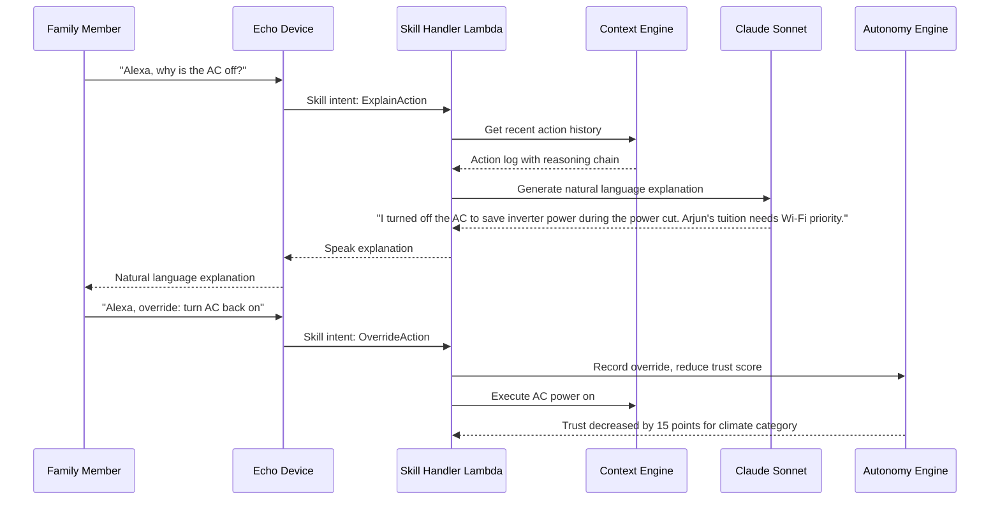

# Design Document: Alexa Thinks Ahead

## Overview

Alexa Thinks Ahead is a proactive AI-powered smart home system built for the HackOn with Amazon Season 6.0 hackathon. The system uses Amazon Bedrock Claude Sonnet as its reasoning engine to anticipate household needs for the Sharma family (6 members across 3 generations) by orchestrating 10 connected devices through a 4-stage cognitive pipeline (SENSE → THINK → ACT → EXPLAIN) and a 5-tier graduated autonomy model.

The architecture is event-driven, built on AWS Lambda, DynamoDB, EventBridge, and API Gateway using AWS SAM for infrastructure-as-code. The system demonstrates contextual intelligence by handling real-world Indian household scenarios (power cuts, multi-generational comfort needs, energy optimization) without hardcoded scenario logic — all decisions flow through Claude Sonnet's contextual reasoning.

The implementation spans 5 phases: Foundation (device adapters, skill base, sensor pipeline), Context Engine (sensor fusion, pattern recognition, routine modeling), Proactive Intelligence (prediction engine, anticipatory actions), Autonomy Tiers (trust scoring, graduated automation), and Continuous Learning (Bayesian preferences, seasonal adaptation).

## Architecture



## Sequence Diagrams

### Main Cognitive Pipeline Cycle



### Power Cut Demo Scenario



### Alexa Voice Interaction Flow



## Components and Interfaces

### Component 1: Device Adapter Layer

**Purpose**: Provides a unified interface for communicating with all 10 smart home devices regardless of brand or protocol.

**Interface**:
```python
from abc import ABC, abstractmethod
from dataclasses import dataclass
from typing import Dict, Any, Optional, List
from datetime import datetime
from enum import Enum

class DeviceCategory(Enum):
    CLIMATE = "climate"
    LIGHTING = "lighting"
    SECURITY = "security"
    KITCHEN = "kitchen"
    UTILITY = "utility"
    POWER = "power"
    ENTERTAINMENT = "entertainment"
    ASSISTANT = "assistant"

@dataclass
class DeviceState:
    device_id: str
    device_type: str
    category: DeviceCategory
    status: str  # "online", "offline", "error"
    properties: Dict[str, Any]
    last_updated: datetime
    battery_level: Optional[float] = None

@dataclass
class DeviceCommand:
    command_id: str
    device_id: str
    action: str
    parameters: Dict[str, Any]
    source: str  # "autonomy", "user", "schedule"
    tier_required: int
    reversible: bool

@dataclass
class CommandResult:
    command_id: str
    success: bool
    device_id: str
    new_state: Optional[DeviceState]
    error_message: Optional[str] = None
    execution_time_ms: int = 0

class DeviceAdapter(ABC):
    """Abstract base for all device adapters."""

    @abstractmethod
    def get_state(self) -> DeviceState:
        ...

    @abstractmethod
    def execute_command(self, command: DeviceCommand) -> CommandResult:
        ...

    @abstractmethod
    def subscribe_events(self, callback) -> str:
        ...

    @abstractmethod
    def get_capabilities(self) -> List[str]:
        ...
```

**Responsibilities**:
- Normalize heterogeneous device APIs into a unified interface
- Translate commands into device-specific protocols
- Handle connection failures with retry logic and circuit breakers
- Emit device events to EventBridge

### Component 2: Context Engine

**Purpose**: Fuses sensor data from all devices into a unified home state, detects temporal patterns, and models family routines.

**Interface**:
```python
from dataclasses import dataclass, field
from typing import Dict, List, Optional
from datetime import datetime

@dataclass
class TemporalPattern:
    pattern_id: str
    pattern_type: str  # "daily", "weekly", "seasonal"
    confidence: float  # 0.0 to 1.0
    devices_involved: List[str]
    schedule: Dict[str, Any]
    last_observed: datetime

@dataclass
class FamilyActivity:
    member_name: str
    activity: str
    location: str
    start_time: datetime
    estimated_end: Optional[datetime]
    devices_in_use: List[str]

@dataclass
class ContextSnapshot:
    snapshot_id: str
    timestamp: datetime
    device_states: Dict[str, DeviceState]
    active_activities: List[FamilyActivity]
    detected_patterns: List[TemporalPattern]
    resource_levels: Dict[str, float]  # battery, water, etc.
    environmental: Dict[str, Any]  # weather, time_of_day, season
    confidence: float

class ContextEngine:
    """Builds unified context from device telemetry and patterns."""

    def build_snapshot(self) -> ContextSnapshot:
        ...

    def detect_patterns(self, history_hours: int = 24) -> List[TemporalPattern]:
        ...

    def get_active_activities(self) -> List[FamilyActivity]:
        ...

    def get_resource_levels(self) -> Dict[str, float]:
        ...

    def resolve_conflicts(self, activities: List[FamilyActivity]) -> List[FamilyActivity]:
        ...
```

**Responsibilities**:
- Aggregate device states with temporal weighting (recent data weighted higher)
- Identify recurring patterns (daily routines, weekly cycles, seasonal shifts)
- Model per-member schedules from calendar + historical usage
- Resolve conflicting device needs between family members
- Maintain a queryable context cache updated every 30 seconds

### Component 3: Proactive Intelligence Engine

**Purpose**: Generates anticipatory action predictions using Claude Sonnet reasoning over the current context.

**Interface**:
```python
from dataclasses import dataclass
from typing import List, Dict, Any
from enum import Enum

class ActionType(Enum):
    AUTO_EXECUTE = "auto_execute"
    RECOMMEND = "recommend"
    INFORM = "inform"

@dataclass
class Prediction:
    prediction_id: str
    strategy: str  # "pre_cooling", "geyser_preheat", "security_arm", etc.
    target_devices: List[str]
    actions: List[DeviceCommand]
    confidence: float
    action_type: ActionType
    reasoning: str
    estimated_benefit: str

@dataclass
class ActionPlan:
    plan_id: str
    event_id: Optional[str]
    predictions: List[Prediction]
    reasoning_chain: str
    context_snapshot_id: str
    created_at: datetime

class ProactiveEngine:
    """Generates anticipatory actions via Claude Sonnet reasoning."""

    def evaluate_context(self, snapshot: ContextSnapshot) -> ActionPlan:
        ...

    def handle_event(self, event: Dict[str, Any], snapshot: ContextSnapshot) -> ActionPlan:
        ...

    def get_confidence_threshold(self, strategy: str) -> float:
        ...
```

**Responsibilities**:
- Invoke Claude Sonnet with structured context for reasoning
- Generate predictions across 6+ intelligence strategies
- Apply confidence thresholds (action vs. recommendation vs. inform)
- Handle both scheduled evaluations and event-triggered reasoning
- Produce explanable reasoning chains for transparency

### Component 4: Autonomy Tier Engine

**Purpose**: Manages graduated automation levels per family member per device category, with trust scoring and escalation/de-escalation logic.

**Interface**:
```python
from dataclasses import dataclass
from typing import Dict, Optional
from datetime import datetime

@dataclass
class TrustScore:
    member: str
    category: DeviceCategory
    score: float  # 0 to 100
    current_tier: int  # 1 to 5
    last_interaction: datetime
    consecutive_acceptances: int
    override_count_30d: int

@dataclass
class TierDecision:
    action: DeviceCommand
    permitted: bool
    current_tier: int
    required_tier: int
    requires_confirmation: bool
    reason: str

class AutonomyEngine:
    """Manages trust scores and tier-based action permissions."""

    def check_permission(self, member: str, action: DeviceCommand) -> TierDecision:
        ...

    def record_acceptance(self, member: str, category: DeviceCategory) -> None:
        ...

    def record_override(self, member: str, category: DeviceCategory) -> None:
        ...

    def get_trust_score(self, member: str, category: DeviceCategory) -> TrustScore:
        ...

    def apply_decay(self) -> None:
        ...

    def check_escalation(self, member: str, category: DeviceCategory) -> Optional[Dict]:
        ...
```

**Responsibilities**:
- Maintain per-member, per-category trust scores (0-100)
- Map trust scores to tiers: 0-20=Inform, 21-45=Suggest, 46-70=Auto-Reversible, 71-90=Auto-Irreversible, 91-100=Full Autonomy
- Handle escalation (sustained trust over 7-day window)
- Handle immediate de-escalation on override (-15 points)
- Apply trust decay during inactivity periods
- Enforce per-device and per-context tier limits

### Component 5: Continuous Learning Engine

**Purpose**: Improves system accuracy over time through feedback collection, Bayesian preference updating, and seasonal model adaptation.

**Interface**:
```python
from dataclasses import dataclass
from typing import Dict, List, Optional
from datetime import datetime

@dataclass
class PreferenceDistribution:
    key: str
    mean: float
    variance: float
    sample_count: int
    last_updated: datetime
    seasonal_bias: Dict[str, float]

@dataclass
class FeedbackEvent:
    event_id: str
    member: str
    feedback_type: str  # "explicit_rating", "override", "acceptance", "adjustment"
    context: Dict[str, Any]
    signal_value: float  # -1.0 to 1.0
    timestamp: datetime

class LearningEngine:
    """Continuously refines predictions from feedback signals."""

    def process_feedback(self, event: FeedbackEvent) -> None:
        ...

    def get_preference(self, key: str, season: Optional[str] = None) -> PreferenceDistribution:
        ...

    def predict_preference(self, context: Dict[str, Any]) -> Dict[str, float]:
        ...

    def get_seasonal_model(self, season: str) -> Dict[str, Any]:
        ...

    def get_personalization_index(self, member: str) -> float:
        ...
```

**Responsibilities**:
- Collect feedback from multiple channels (explicit ratings, overrides, adjustments, engagement)
- Apply Bayesian inference to update preference distributions
- Maintain seasonal models (summer, monsoon, autumn, winter for Indian climate)
- Track personalization index per family member
- Decay old observations gradually (90-day rolling window)

### Component 6: Reasoning Client (Bedrock Integration)

**Purpose**: Interfaces with Amazon Bedrock Claude Sonnet for contextual reasoning and natural language generation.

**Interface**:
```python
from dataclasses import dataclass
from typing import Dict, Any, List

@dataclass
class ReasoningRequest:
    context: ContextSnapshot
    event: Optional[Dict[str, Any]]
    preferences: Dict[str, PreferenceDistribution]
    autonomy_config: Dict[str, int]
    query_type: str  # "action_plan", "explanation", "prediction"

@dataclass
class ReasoningResponse:
    actions: List[Dict[str, Any]]
    reasoning_chain: str
    confidence: float
    explanation: str
    latency_ms: int

class BedrockReasoningClient:
    """Interfaces with Amazon Bedrock Claude Sonnet."""

    def invoke_reasoning(self, request: ReasoningRequest) -> ReasoningResponse:
        ...

    def generate_explanation(self, actions: List[Dict], reasoning: str) -> str:
        ...

    def build_prompt(self, request: ReasoningRequest) -> str:
        ...
```

**Responsibilities**:
- Build structured prompts for Claude Sonnet with context, preferences, and constraints
- Handle API rate limiting with exponential backoff and jitter
- Enforce 3-second timeout for time-sensitive decisions
- Cache responses for common scenarios to reduce latency
- Parse model responses into structured action plans

### Component 7: Lambda Handlers

**Purpose**: AWS Lambda entry points for skill requests, API calls, event processing, and scheduled context fusion.

**Interface**:
```python
from typing import Dict, Any

class SkillHandler:
    """Handles Alexa Smart Home Skill API requests."""

    def lambda_handler(self, event: Dict[str, Any], context: Any) -> Dict[str, Any]:
        ...

    def handle_discovery(self, event: Dict) -> Dict:
        ...

    def handle_control(self, event: Dict) -> Dict:
        ...

    def handle_query(self, event: Dict) -> Dict:
        ...

class APIHandler:
    """Handles REST API Gateway requests."""

    def lambda_handler(self, event: Dict[str, Any], context: Any) -> Dict[str, Any]:
        ...

class EventHandler:
    """Handles EventBridge device events."""

    def lambda_handler(self, event: Dict[str, Any], context: Any) -> Dict[str, Any]:
        ...

class ContextScheduleHandler:
    """Handles scheduled context fusion (every 30 seconds)."""

    def lambda_handler(self, event: Dict[str, Any], context: Any) -> Dict[str, Any]:
        ...
```

**Responsibilities**:
- Route Alexa skill intents (Discovery, Control, Query, Explain, Override)
- Serve REST API endpoints for device management and context queries
- Process EventBridge events for real-time device state changes
- Execute scheduled context fusion cycles

## Data Models

### Model 1: DeviceState (DynamoDB)

```python
@dataclass
class DeviceStateRecord:
    device_id: str          # Partition key
    timestamp: str          # Sort key (ISO 8601)
    device_type: str
    category: str
    status: str
    properties: Dict[str, Any]
    battery_level: Optional[float]
    ttl: int               # 30-day TTL for auto-cleanup
```

**Validation Rules**:
- device_id must match registered device in device registry
- timestamp must be valid ISO 8601
- status must be one of: "online", "offline", "error"
- category must be one of the 8 DeviceCategory values
- properties schema varies by device_type but must be non-empty

### Model 2: ContextSnapshot (DynamoDB)

```python
@dataclass
class ContextSnapshotRecord:
    snapshot_id: str        # Partition key (UUID)
    timestamp: str          # Sort key
    device_states: Dict[str, Any]
    active_activities: List[Dict[str, Any]]
    patterns: List[Dict[str, Any]]
    resource_levels: Dict[str, float]
    environmental: Dict[str, Any]
    confidence: float
    ttl: int
```

**Validation Rules**:
- confidence must be between 0.0 and 1.0
- resource_levels values must be between 0.0 and 1.0
- device_states must contain entries for all 10 registered devices
- patterns confidence scores must be between 0.0 and 1.0

### Model 3: ActionPlan (DynamoDB)

```python
@dataclass
class ActionPlanRecord:
    plan_id: str            # Partition key (UUID)
    timestamp: str          # Sort key
    event_id: Optional[str]
    actions: List[Dict[str, Any]]
    reasoning_chain: str
    tier_required: int
    confidence: float
    status: str            # "pending", "executed", "rejected", "expired"
    ttl: int
```

**Validation Rules**:
- tier_required must be between 1 and 5
- confidence must be between 0.0 and 1.0
- status must be one of: "pending", "executed", "rejected", "expired"
- actions list must be non-empty

### Model 4: TrustScore (DynamoDB)

```python
@dataclass
class TrustScoreRecord:
    member_category: str    # Partition key ("rajesh#climate")
    updated_at: str         # Sort key
    score: float
    current_tier: int
    consecutive_acceptances: int
    override_count_30d: int
    escalation_window_start: Optional[str]
```

**Validation Rules**:
- score must be between 0 and 100
- current_tier must be between 1 and 5
- consecutive_acceptances must be non-negative
- override_count_30d must be non-negative

### Model 5: FamilyProfile (DynamoDB)

```python
@dataclass
class FamilyProfileRecord:
    family_id: str          # Partition key
    member_name: str        # Sort key
    role: str
    preferred_echo: str
    routines: List[Dict[str, Any]]
    autonomy_preferences: Dict[str, int]
    notification_preferences: Dict[str, str]
```

**Validation Rules**:
- role must be one of: "parent", "child", "elder"
- autonomy_preferences values must be between 1 and 5
- preferred_echo must be a valid device_id

### Model 6: PreferenceDistribution (DynamoDB)

```python
@dataclass
class PreferenceRecord:
    preference_key: str     # Partition key ("rajesh#climate#temperature")
    season: str             # Sort key ("summer", "monsoon", "autumn", "winter", "all")
    mean: float
    variance: float
    sample_count: int
    last_updated: str
    confidence: float
```

**Validation Rules**:
- variance must be non-negative
- sample_count must be positive
- confidence must be between 0.0 and 1.0
- season must be one of: "summer", "monsoon", "autumn", "winter", "all"

## Algorithmic Pseudocode

### Algorithm 1: Sensor Fusion with Temporal Weighting

```python
def fuse_sensor_data(
    device_states: Dict[str, DeviceState],
    max_staleness_seconds: int = 3600
) -> Dict[str, Dict[str, Any]]:
    """
    Fuse device states with temporal weighting.
    Recent readings get higher weight, stale data gets diminished influence.
    """
    fused = {}
    now = datetime.now(timezone.utc)

    for device_id, state in device_states.items():
        age_seconds = (now - state.last_updated).total_seconds()
        weight = max(0.1, 1.0 - (age_seconds / max_staleness_seconds))

        fused[device_id] = {
            "properties": state.properties,
            "weight": weight,
            "status": state.status,
            "stale": age_seconds > max_staleness_seconds
        }

    return fused
```

**Preconditions:**
- All device_states have valid `last_updated` timestamps
- max_staleness_seconds is positive

**Postconditions:**
- Every device in input appears in output
- All weights are between 0.1 and 1.0
- Stale flag is True if and only if age exceeds max_staleness_seconds

**Loop Invariants:**
- For each processed device: 0.1 ≤ weight ≤ 1.0

### Algorithm 2: Trust Score Update

```python
def update_trust_score(
    current_score: float,
    accepted: bool,
    acceptance_delta: float = 5.0,
    override_penalty: float = 15.0
) -> float:
    """
    Update trust score based on user interaction outcome.
    Acceptance gradually increases trust; override immediately decreases it.
    """
    if accepted:
        new_score = current_score + min(acceptance_delta, 100.0 - current_score)
    else:
        new_score = max(0.0, current_score - override_penalty)

    return new_score
```

**Preconditions:**
- 0 ≤ current_score ≤ 100
- acceptance_delta > 0
- override_penalty > 0

**Postconditions:**
- 0 ≤ result ≤ 100
- If accepted: result ≥ current_score
- If not accepted: result ≤ current_score
- Score never exceeds 100 or drops below 0

### Algorithm 3: Tier Determination from Trust Score

```python
TIER_THRESHOLDS = [0, 21, 46, 71, 91]

def determine_tier(score: float) -> int:
    """
    Map a trust score (0-100) to an autonomy tier (1-5).
    """
    tier = 1
    for i, threshold in enumerate(TIER_THRESHOLDS):
        if score >= threshold:
            tier = i + 1
    return tier
```

**Preconditions:**
- 0 ≤ score ≤ 100

**Postconditions:**
- 1 ≤ result ≤ 5
- result == 1 if score < 21
- result == 5 if score >= 91
- Tier is monotonically non-decreasing with score

### Algorithm 4: Bayesian Preference Update

```python
def bayesian_update(
    prior_mean: float,
    prior_variance: float,
    observation: float,
    observation_noise: float = 1.0
) -> tuple[float, float]:
    """
    Bayesian update of preference distribution given new observation.
    Uses conjugate Gaussian update.
    """
    precision_prior = 1.0 / prior_variance if prior_variance > 0 else 1.0
    precision_obs = 1.0 / observation_noise

    posterior_precision = precision_prior + precision_obs
    posterior_variance = 1.0 / posterior_precision
    posterior_mean = (
        (precision_prior * prior_mean + precision_obs * observation)
        / posterior_precision
    )

    return posterior_mean, posterior_variance
```

**Preconditions:**
- prior_variance > 0
- observation_noise > 0

**Postconditions:**
- posterior_variance < prior_variance (variance always decreases with more data)
- posterior_mean is between prior_mean and observation (weighted average)
- posterior_variance > 0

### Algorithm 5: Confidence-Based Action Routing

```python
def route_action(
    prediction: Prediction,
    action_threshold: float = 0.85,
    recommend_threshold: float = 0.60,
    inform_threshold: float = 0.40
) -> ActionType:
    """
    Route a prediction to the appropriate action type based on confidence.
    """
    if prediction.confidence >= action_threshold:
        return ActionType.AUTO_EXECUTE
    elif prediction.confidence >= recommend_threshold:
        return ActionType.RECOMMEND
    elif prediction.confidence >= inform_threshold:
        return ActionType.INFORM
    else:
        return None  # Below inform threshold, discard
```

**Preconditions:**
- 0 ≤ prediction.confidence ≤ 1.0
- action_threshold > recommend_threshold > inform_threshold > 0

**Postconditions:**
- If confidence ≥ action_threshold: AUTO_EXECUTE
- If confidence ≥ recommend_threshold but < action_threshold: RECOMMEND
- If confidence ≥ inform_threshold but < recommend_threshold: INFORM
- If confidence < inform_threshold: None (discard)

### Algorithm 6: Escalation Check

```python
def check_escalation_eligibility(
    trust_score: TrustScore,
    min_window_days: int = 7,
    min_acceptance_rate: float = 0.80
) -> bool:
    """
    Check if a trust score qualifies for tier escalation.
    Requires sustained trust over a configurable window.
    """
    days_at_level = (datetime.now(timezone.utc) - trust_score.last_interaction).days

    if days_at_level < min_window_days:
        return False

    total_interactions = trust_score.consecutive_acceptances + trust_score.override_count_30d
    if total_interactions == 0:
        return False

    acceptance_rate = trust_score.consecutive_acceptances / total_interactions

    if acceptance_rate < min_acceptance_rate:
        return False

    next_tier = trust_score.current_tier + 1
    if next_tier > 5:
        return False

    required_score = TIER_THRESHOLDS[next_tier - 1]
    return trust_score.score >= required_score
```

**Preconditions:**
- trust_score is a valid TrustScore object
- min_window_days > 0
- 0 < min_acceptance_rate ≤ 1.0

**Postconditions:**
- Returns True only if ALL conditions met: sufficient time, sufficient acceptance rate, score meets threshold, not already at max tier
- Returns False if any condition fails

## Key Functions with Formal Specifications

### Function: build_reasoning_prompt()

```python
def build_reasoning_prompt(
    snapshot: ContextSnapshot,
    event: Optional[Dict[str, Any]],
    preferences: Dict[str, PreferenceDistribution],
    autonomy_config: Dict[str, int]
) -> str:
    ...
```

**Preconditions:**
- snapshot contains valid device states for all 10 devices
- preferences contains at least one entry per family member
- autonomy_config maps device categories to tier limits

**Postconditions:**
- Returns a non-empty string suitable for Claude Sonnet invocation
- Prompt includes current device states, active activities, detected patterns
- Prompt includes family preferences and autonomy constraints
- Prompt length does not exceed Bedrock model input limits

### Function: execute_action_plan()

```python
def execute_action_plan(
    plan: ActionPlan,
    autonomy_engine: AutonomyEngine,
    device_registry: Dict[str, DeviceAdapter]
) -> List[CommandResult]:
    ...
```

**Preconditions:**
- All devices referenced in plan.predictions exist in device_registry
- autonomy_engine has current trust scores for relevant members
- plan.predictions is non-empty

**Postconditions:**
- Returns one CommandResult per attempted action
- Actions only executed if autonomy tier permits
- Failed commands have error_message populated
- No side effects for actions that fail permission check

### Function: collect_and_process_feedback()

```python
def collect_and_process_feedback(
    interaction_result: CommandResult,
    member: str,
    learning_engine: LearningEngine,
    autonomy_engine: AutonomyEngine
) -> None:
    ...
```

**Preconditions:**
- interaction_result is a valid CommandResult
- member is a registered family member name
- Both engines are initialized

**Postconditions:**
- If command was accepted: trust score increased, preference distribution updated
- If command was overridden: trust score decreased by 15, tier may de-escalate
- Learning engine preference updated via Bayesian inference
- No exception raised regardless of input

## Example Usage

```python
import boto3
from datetime import datetime, timezone

# Initialize system components
bedrock_client = boto3.client("bedrock-runtime", region_name="ap-south-1")
dynamodb = boto3.resource("dynamodb", region_name="ap-south-1")

# Device registry
device_registry = {
    "living_room_ac": DaikinACAdapter(device_id="living_room_ac"),
    "smart_lights": PhilipsHueAdapter(device_id="smart_lights"),
    "security_camera": RingCameraAdapter(device_id="security_camera"),
    "smart_lock": YaleLockAdapter(device_id="smart_lock"),
    "kitchen_hub": SamsungKitchenAdapter(device_id="kitchen_hub"),
    "water_purifier": KentPurifierAdapter(device_id="water_purifier"),
    "smart_geyser": HavellsGeyserAdapter(device_id="smart_geyser"),
    "inverter_ups": LuminousInverterAdapter(device_id="inverter_ups"),
    "smart_tv": FireTVAdapter(device_id="smart_tv"),
    "echo_devices": EchoAdapter(device_id="echo_devices"),
}

# Initialize engines
context_engine = ContextEngine(
    devices=device_registry,
    history_store=DynamoDBHistoryStore(dynamodb.Table("device_states")),
)
reasoning_client = BedrockReasoningClient(
    client=bedrock_client,
    model_id="anthropic.claude-3-sonnet",
)
autonomy_engine = AutonomyEngine(
    family_members=["rajesh", "priya", "arjun", "ananya", "dadaji", "dadiji"],
    device_categories=list(DeviceCategory),
)
learning_engine = LearningEngine(
    preference_store=DynamoDBPreferenceStore(dynamodb.Table("preferences")),
)

# Example: Run a full cognitive cycle
snapshot = context_engine.build_snapshot()
plan = reasoning_client.invoke_reasoning(ReasoningRequest(
    context=snapshot,
    event=None,
    preferences=learning_engine.predict_preference(snapshot.__dict__),
    autonomy_config=autonomy_engine.get_tier_config(),
    query_type="action_plan",
))

# Execute approved actions
for prediction in plan.predictions:
    for action in prediction.actions:
        decision = autonomy_engine.check_permission("rajesh", action)
        if decision.permitted:
            result = device_registry[action.device_id].execute_command(action)
            collect_and_process_feedback(result, "rajesh", learning_engine, autonomy_engine)

# Example: Handle power cut event
power_cut_event = {
    "event_type": "power_cut",
    "source": "inverter_ups",
    "timestamp": datetime.now(timezone.utc).isoformat(),
    "details": {"grid_status": "offline", "battery_level": 0.80}
}
emergency_plan = reasoning_client.invoke_reasoning(ReasoningRequest(
    context=context_engine.build_snapshot(),
    event=power_cut_event,
    preferences=learning_engine.predict_preference({}),
    autonomy_config=autonomy_engine.get_tier_config(),
    query_type="action_plan",
))
```

## Error Handling

### Error Scenario 1: Bedrock API Timeout

**Condition**: Claude Sonnet inference exceeds 3-second timeout
**Response**: Fall back to cached predictions for common scenarios; execute only high-confidence pre-computed actions
**Recovery**: Retry with exponential backoff (1s, 2s, 4s); log timeout for monitoring; if 3 consecutive failures, switch to rule-based fallback engine

### Error Scenario 2: Device Communication Failure

**Condition**: Device adapter cannot reach a smart device (network issue, device offline)
**Response**: Mark device state as "stale" with last-known values; exclude from active reasoning; notify relevant family member
**Recovery**: Retry connection every 60 seconds; after 5 minutes offline, raise alert; re-include in reasoning once connection restored

### Error Scenario 3: DynamoDB Throttling

**Condition**: Read/write capacity exceeded on state table
**Response**: Queue writes to in-memory buffer; serve reads from context cache; log throttling event
**Recovery**: Flush buffer when capacity available; switch to on-demand billing if sustained; alert on repeated throttling

### Error Scenario 4: Invalid Bedrock Response

**Condition**: Claude Sonnet returns malformed or unparseable response
**Response**: Discard response; do not execute any actions; log full response for debugging
**Recovery**: Retry with simplified prompt; if persistent, escalate to inform-only mode (Tier 1 behavior)

### Error Scenario 5: Trust Score Inconsistency

**Condition**: Trust score exceeds valid range or tier mapping is inconsistent
**Response**: Reset to last known valid state; log anomaly with full context
**Recovery**: Recalculate from interaction history; apply conservative tier (lower of calculated vs. current)

### Error Scenario 6: Concurrent Device Command Conflict

**Condition**: Two action plans attempt contradictory commands on same device simultaneously
**Response**: Apply last-writer-wins with priority weighting (safety > comfort > efficiency)
**Recovery**: Log conflict for pattern analysis; surface to family member if high-impact

## Testing Strategy

### Unit Testing Approach

- Test each component in isolation with mocked dependencies
- Use `pytest` with `moto` for AWS service mocking (DynamoDB, Lambda, EventBridge, Bedrock)
- Target 90% coverage on core logic (context engine, autonomy engine, learning engine)
- Test all device adapters with mock device responses
- Test trust score calculations with boundary values
- Test Bayesian update correctness with known distributions

### Property-Based Testing Approach

- Use `hypothesis` library for property-based testing
- Minimum 100 iterations per property test
- Focus on universal invariants that must hold across all inputs
- Key areas: trust score bounds, tier monotonicity, Bayesian update convergence, sensor fusion weight bounds

**Property Test Library**: hypothesis (Python)

### Integration Testing Approach

- Test full cognitive pipeline with mocked AWS services (moto + localstack)
- Test Alexa skill handler with sample request/response pairs
- Test API endpoints with realistic payloads
- Test event-driven flows through EventBridge to Lambda
- Test demo scenario (power cut) end-to-end

## Performance Considerations

- Bedrock inference latency target: < 2 seconds for time-sensitive decisions
- Context fusion cycle: < 500ms for 10 devices
- DynamoDB query latency: < 50ms for state reads
- Lambda cold start mitigation: provisioned concurrency for skill handler
- Context cache reduces Bedrock calls for repeated similar contexts
- EventBridge batching for high-frequency sensor events (group within 5-second windows)

## Security Considerations

- All data encrypted at rest (DynamoDB, S3) and in transit (TLS 1.2+)
- API Gateway JWT authorizer for REST endpoints
- Alexa skill validation (verify skill ID, request signature)
- No PII sent to Bedrock — abstract family member references used in prompts
- Device tokens stored in AWS Secrets Manager with 30-day rotation
- IAM least-privilege policies per Lambda function
- Security device commands (lock, camera) require minimum Tier 4 autonomy

## Dependencies

| Dependency | Purpose | Version |
|------------|---------|---------|
| boto3 | AWS SDK for Python | 1.28+ |
| moto | AWS service mocking for tests | 4.2+ |
| hypothesis | Property-based testing | 6.82+ |
| pytest | Test framework | 7.4+ |
| pydantic | Data validation (optional) | 2.0+ |
| aws-sam-cli | Infrastructure deployment | 1.95+ |
| python-dateutil | Date/time utilities | 2.8+ |

## Correctness Properties

*A property is a characteristic or behavior that should hold true across all valid executions of a system — essentially, a formal statement about what the system should do. Properties serve as the bridge between human-readable specifications and machine-verifiable correctness guarantees.*

### Property 1: Trust Score Bounds Invariant

*For any* sequence of trust score operations (acceptances, overrides, and decay), the resulting trust score SHALL always remain within the range [0, 100] inclusive regardless of the number or order of operations applied.

**Validates: Requirements 5.1, 5.3, 5.4**

### Property 2: Tier Monotonicity with Score

*For any* two trust scores where score_a < score_b, the tier determined for score_a SHALL be less than or equal to the tier determined for score_b (tier mapping is monotonically non-decreasing with score).

**Validates: Requirements 5.2**

### Property 3: Override Always Decreases Trust

*For any* valid trust score greater than 0, recording an override SHALL produce a new score that is strictly less than the original score. For a score of 0, override SHALL leave it at 0.

**Validates: Requirements 5.4, 5.7**

### Property 4: Acceptance Never Decreases Trust

*For any* valid trust score, recording an acceptance SHALL produce a new score that is greater than or equal to the original score.

**Validates: Requirements 5.3**

### Property 5: Bayesian Update Variance Reduction

*For any* valid prior distribution (mean, variance > 0) and any observation value, the posterior variance after Bayesian update SHALL be strictly less than the prior variance.

**Validates: Requirements 6.2**

### Property 6: Sensor Fusion Weight Bounds

*For any* device state with any valid timestamp (recent or stale), the computed temporal weight SHALL be between 0.1 and 1.0 inclusive, with more recent timestamps producing weights closer to 1.0.

**Validates: Requirements 2.2**

### Property 7: Action Routing Consistency

*For any* prediction with confidence C: if C ≥ 0.85 then the routed action type SHALL be AUTO_EXECUTE; if 0.60 ≤ C < 0.85 then RECOMMEND; if 0.40 ≤ C < 0.60 then INFORM; if C < 0.40 then the prediction SHALL be discarded.

**Validates: Requirements 4.2, 4.3, 4.4, 4.5**

### Property 8: Context Snapshot Completeness

*For any* context snapshot built from the device registry (regardless of individual device online/offline status), the snapshot SHALL contain state entries for all 10 registered devices.

**Validates: Requirements 2.3, 12.2**

### Property 9: Tier Permission Consistency

*For any* action requiring tier T and a member with current tier C, the permission decision SHALL be "permitted" if and only if C ≥ T.

**Validates: Requirements 5.5**

### Property 10: De-escalation Immediacy on Override

*For any* override event applied to any trust score, the resulting tier SHALL be less than or equal to the tier before the override (tier never increases on override).

**Validates: Requirements 5.4, 5.7**

### Property 11: Conflict Resolution Priority Ordering

*For any* two conflicting action plans targeting the same device where one has safety priority and the other has comfort or efficiency priority, the safety-priority plan SHALL always be selected over the lower-priority plan.

**Validates: Requirements 3.4, 12.4**
