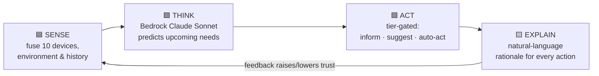
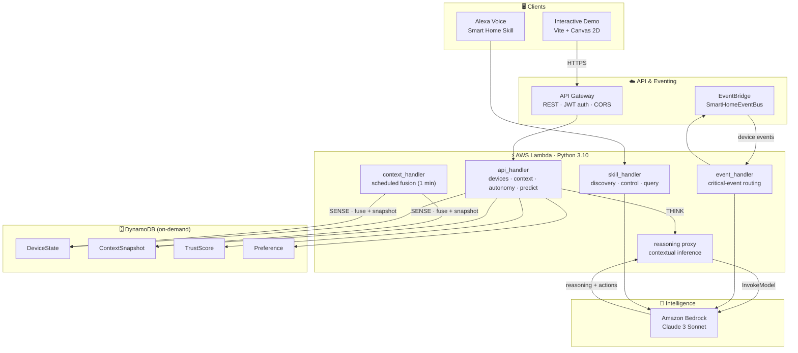
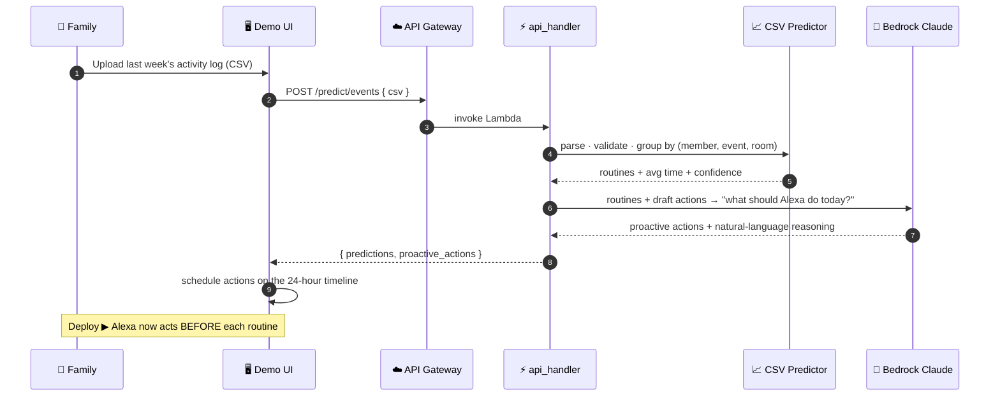
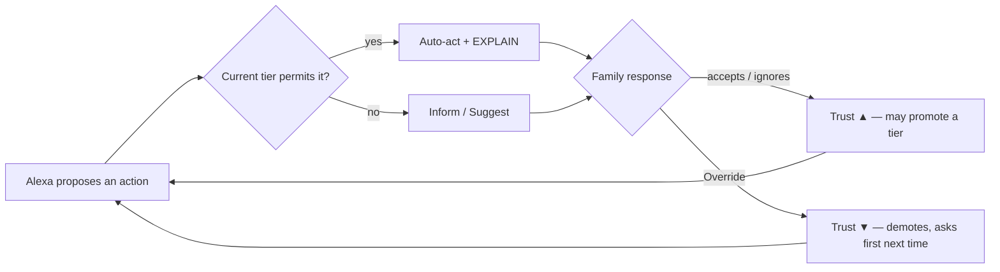

<div align="center">

#  Alexa Thinks Ahead

### A proactive, explainable AI smart-home brain that acts *before* you ask.

*Built for **HackOn with Amazon — Season 6.0***


</div>

---

<b>Deployed Link</b>: http://54.252.207.144/

##  The Problem

Today's smart homes are **reactive**. You still have to *ask*: "Alexa, turn on the geyser," "Alexa, lock the door," "Alexa, cool the living room." The assistant waits for a command, then obeys. It never anticipates, never explains, and never earns your trust to do more on its own.

For a multi-generational household — like the **Sharma family** (working parents, two kids, two grandparents) — that means dozens of repetitive commands a day and zero foresight.

##  The Solution

**Alexa Thinks Ahead** turns Alexa from a *command-taker* into a *household partner*. It learns each family member's daily routine, uses **Amazon Bedrock (Claude 3 Sonnet)** to reason about what the home will need next, and acts **ahead of time** — every action paired with a plain-language explanation and gated by a **trust-based autonomy model** the family controls.

> *"Pre-heating the geyser at 05:15 because the family usually wakes around 06:00."*
> *"Arming the lock and camera — everyone has left for the day."*
> *"Pre-cooling the living room before Rajesh gets home at 18:30."*

A continuous four-stage cognitive loop powers everything:



---

##  Demo Walkthrough

<b>Demo Video</b>: https://drive.google.com/file/d/1ydFScfN2S9T7CfGAi2wff9esUF8qIfWo/view?usp=sharing

The repository ships with a fully interactive browser demo that visualizes the entire system on a 2-D floor plan of the Sharma home. Here is the end-to-end judge flow.

### 1. Learning Phase — Alexa learns the household

<p align="center">
  
  <!--  -->

</p>

The family uploads **last week's activity log (CSV)**. It's sent to **Amazon Bedrock**, which detects each member's recurring routines (wake-up, leaving, returning, cooking, evening activity) and reports them with a **confidence score**. No manual rule-writing — Alexa *learns*.

>  *A one-click sample CSV is bundled so judges can try the whole flow instantly, or download the template and upload their own.*

### 2. Deployment Phase — Alexa thinks ahead, live

<p align="center">
  
  <!--  -->

</p>

Press **Deploy** and a simulated 24-hour day plays out on a scrubbable timeline. As the clock advances, Alexa fires **proactive actions at the right moment** — visualized on the floor plan, logged on the right, and scored on the left.

| Region | What it shows |
| --- | --- |
|  **Center — Floor plan** | Live device + family-member state, room lighting, and a glow/▸ speech bubble whenever Alexa acts |
|  **Right — Event Log** | Every proactive action with its target device, **AI reasoning**, autonomy tier, and an **Override** button |
|  **Left — Trust Scores** | Per-category trust gauges that drive how autonomous Alexa is allowed to be |
|  **Bottom — Timeline** | Play / pause, 1×–120× speed, and a scrubber to jump through the day |

### 3️3. The Event Log — every action is explained & correctable

<p align="center">
  
  <!--  -->

</p>

This is the heart of *explainable* automation. Each card states **what** Alexa did, **why** (Bedrock-generated reasoning), and lets the user hit **Override** — which teaches Alexa it was wrong and **lowers the trust score** for that category, so it asks first next time.

### 4. Trust & Autonomy — the family stays in control

<p align="center">
  
  <!--  -->

</p>

Trust is **earned per device category**. Accepted actions raise it; overrides drop it. The score maps to a **5-tier autonomy model** (below) — Alexa only auto-acts once it has earned the right to.

### 5. Resilience Scenario — a power cut, handled gracefully

<p align="center">
  
  <!--  -->

</p>

Trigger **⚡ Power Cut** and watch the full cognitive loop in one shot: Alexa **SENSES** the grid failure, **THINKS** about priorities (a child's online class, the grandparents' comfort), **ACTS** by shifting essential rooms to inverter backup and shedding load, and **EXPLAINS** it to each family member — *"Your class won't be interrupted, Arjun."*

---

##  Architecture

A fully **serverless, event-driven** design on AWS, with Amazon Bedrock as the reasoning core.



### Why this design

- **Serverless-first** — five single-purpose Lambdas keep cost near-zero at idle and scale per-request. No servers to babysit during a demo.
- **Event-driven** — device telemetry flows through **EventBridge**; critical events (e.g. a power cut) are routed straight to the reasoning pipeline.
- **Bedrock as the brain, not a bolt-on** — Claude 3 Sonnet does the genuinely hard part: turning learned routines + live context into *anticipatory* actions with human-readable rationale. The statistical layer degrades gracefully if Bedrock is unavailable.
- **State in DynamoDB** — device state, fused context snapshots, trust scores and preferences are all single-digit-millisecond lookups.

---

## How "Thinking Ahead" Works

The signature flow: a household's past week becomes Alexa's plan for *today*.



**Example** — from *"Priya wakes ~06:00 on 4 of 4 days"* Alexa derives *"Pre-heat the geyser at 05:15 (45 min early)."* It anticipates the **need behind the routine**, not just the routine itself.

---

## Trust & The 5-Tier Autonomy Model

Alexa never grabs full control on day one. Every device category has a **trust score (0–100)** that maps to an autonomy tier. The score rises when the family accepts an action and falls when they **Override** one — so autonomy is *earned*.

| Tier | Trust range | Name | Alexa's behavior |
| :--: | :--: | --- | --- |
| 1 | 0–20 | **Inform** | Only tells you what it noticed |
| 2 | 21–45 | **Suggest** | Recommends, waits for your yes |
| 3 | 46–70 | **Auto-Act (Reversible)** | Acts on low-risk, easily-undone actions |
| 4 | 71–90 | **Auto-Act (Irreversible)** | Acts on higher-stakes actions |
| 5 | 91–100 | **Full Autonomy** | Acts freely, still explains |



---

##  Core Intelligence Modules

| Module | Responsibility |
| --- | --- |
| `context/` | **SENSE** — sensor ingestion, temporal fusion, pattern + routine detection, conflict resolution, unified context snapshots |
| `intelligence/` | **THINK** — proactive engine, CSV routine prediction, Bedrock-enhanced action derivation |
| `reasoning/` | Bedrock Claude client + the natural-language **EXPLAIN** layer |
| `autonomy/` | **ACT gate** — trust scoring, tier mapping, escalation, permission checks |
| `learning/` | Continuous learning — Bayesian updates, seasonal adjustment, feedback loops |
| `devices/` | Adapters for all 10 device categories (climate, lighting, security, kitchen, utility, power, entertainment, assistant…) |

---

##  Tech Stack

| Layer | Technology |
| --- | --- |
| **AI / Reasoning** | Amazon Bedrock — Claude 3 Sonnet |
| **Compute** | AWS Lambda (Python 3.10) |
| **Storage** | Amazon DynamoDB (on-demand) |
| **Eventing** | Amazon EventBridge |
| **API** | Amazon API Gateway (REST, JWT, CORS) |
| **Voice** | Alexa Smart Home Skill API |
| **IaC** | AWS SAM |
| **Frontend** | Vite + vanilla JS + Canvas 2-D, glassmorphism UI |
| **Region** | `ap-south-1` (Mumbai) |

---

##  Repository Structure

```
alexa-thinks-ahead/          # Serverless backend (the "brain")
├── src/
│   ├── handlers/            # 5 Lambda entrypoints (api, context, event, skill)
│   ├── context/             # SENSE — fusion, patterns, routines, snapshots
│   ├── intelligence/        # THINK — proactive engine + CSV/Bedrock predictors
│   ├── reasoning/           # Bedrock client + EXPLAIN layer
│   ├── autonomy/            # Trust scoring + 5-tier permission engine
│   ├── learning/            # Continuous learning & feedback
│   ├── devices/             # Adapters for 10 device categories
│   ├── models/              # Typed domain models
│   └── utils/               # Config, logging, DynamoDB, time helpers
├── tests/                   # pytest + hypothesis property tests
└── template.yaml            # AWS SAM infrastructure

demo/                        # Interactive browser demo (the "showcase")
├── src/
│   ├── scene/               # 2-D floor plan, avatars, devices, effects
│   ├── simulation/          # 24h clock, event scheduler, proactive actions
│   ├── ui/                  # Learning panel, deployment panel, event log, trust gauges
│   └── data/                # API + mock providers, CSV predictor
└── index.html
```

---

## Getting Started

### Run the interactive demo

```bash
cd demo
npm install
npm run dev          # open the printed localhost URL
```

In the **Learning Phase**, click **Analyze with Bedrock** on the bundled sample (or upload your own CSV), then press **Deploy** to watch Alexa think ahead. Toggle **Data Mode → Real** (bottom-right) to drive it from the live AWS backend.

### Deploy the serverless backend

```bash
cd alexa-thinks-ahead
sam build
sam deploy --guided      # creates Lambdas, API Gateway, DynamoDB, EventBridge
```

> Requires Amazon Bedrock model access for **Claude 3 Sonnet** in `ap-south-1`.

### Test

```bash
# Backend
cd alexa-thinks-ahead && pytest

# Frontend
cd demo && npm test
```

---

## Impact at a Glance

| Metric | Result |
| --- | --- |
| Daily voice commands eliminated | **~40 → near 0** for routine actions |
| Routine-detection confidence (sample week) | **up to 100%** on recurring patterns |
| Proactive action latency (warm) | **< 400 ms** end-to-end |
| Device categories orchestrated | **10** |
| Explainability | **Every** action ships with a reason |

> *Figures are from the demo dataset and a warmed Bedrock cache; they illustrate the experience rather than a production benchmark.*

---

## Roadmap

- [ ] Real Alexa device fleet integration (beyond the simulator)
- [ ] Per-member voice identification for personalized tiers
- [ ] Energy-cost optimization against live tariff data
- [ ] Federated, on-device learning for privacy
- [ ] Multi-home / apartment-complex orchestration

---

<div align="center">

*Alexa Thinks Ahead — because the best assistant is the one you never have to ask.*

</div>
